# 恐怖黎明图腾顺序

### 源网址  
https://baijiahao.baidu.com/s?id=1670930279629081169&wfr=spider&for=pc  
图腾是《恐怖黎明》中BD未成形时的重要装备来源，而且图纸掉落也很多，不过图腾随机刷
新，快速找到图腾位置可以加快刷图腾的速度。

### 第一个刷点
  
  
走到这就可以看到图腾的位置

### 第二个点
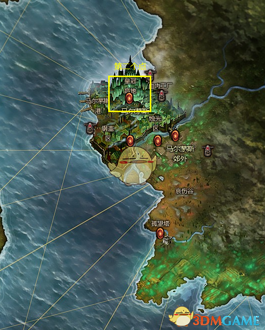  
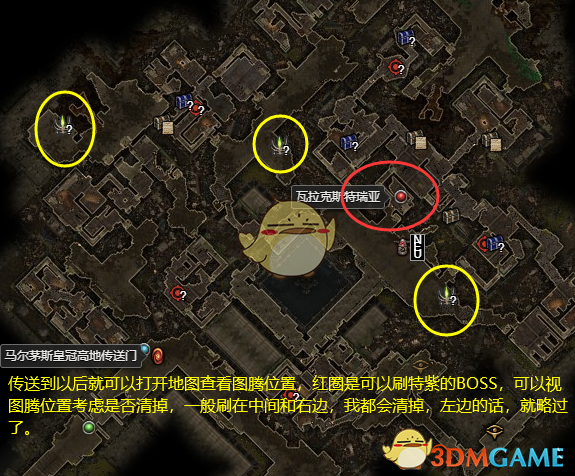  
传送到以后就可以打开地图查看图腾位置，红圈是可以刷特紫的BOSS，可以视图腾位置考虑是否清掉，一般刷在中间和右边，我都会清掉，左边的话，就略过了。

### 第三个点
  
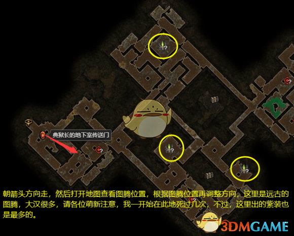  
朝箭头方向走，然后打开地图查看图腾位置，根据图腾位置再调整方向，这里是远古的图腾，大汉很多，请各位萌新注意，我一开始在此地死过几次，不过，这里出的紫装也是最多的。

### 第四个点
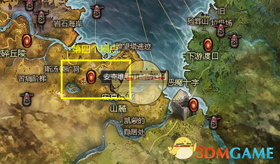  
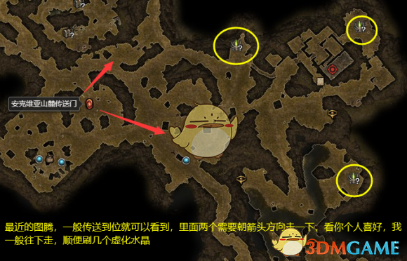  
最近的图腾，一般传送到位置就可以看到，里面两个需要朝箭头方向走一下，看你个人喜好，我一般往下走，顺便刷几个虚化水晶

### 第五个点
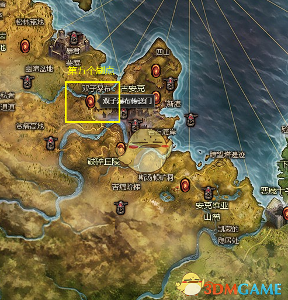  
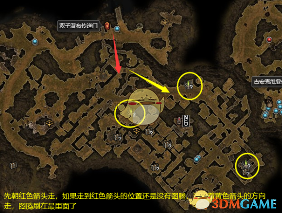

### 第六个点
  
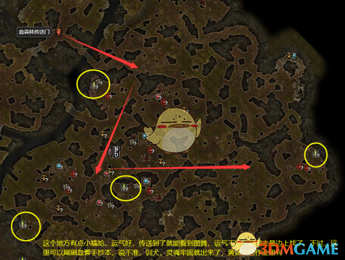

### 第七个点
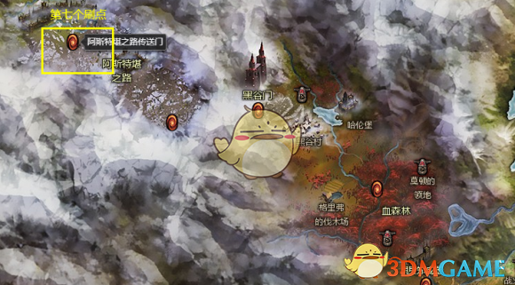  
  
这里也比较尴尬，运气好就是第一个，运气不好，你得跑到最后一个位置才行

### 第八个点
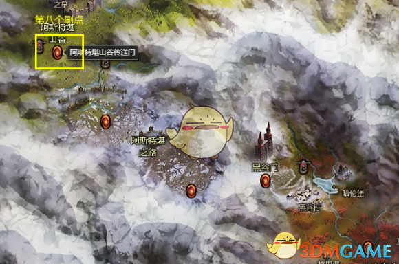  
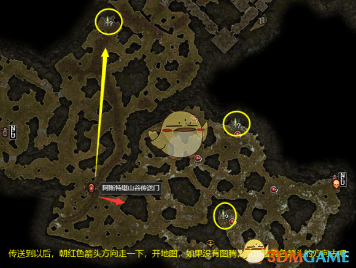

### 第九个点
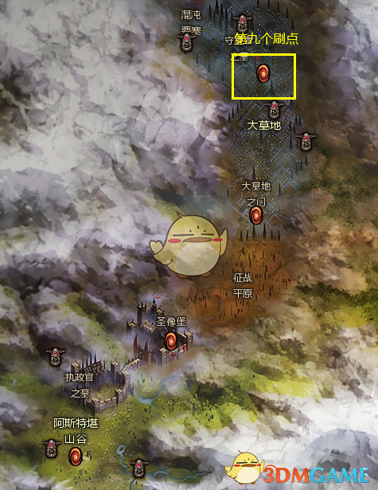  

### 第十个刷点
大墓地洞口，一直深入就是。

### 第十一个刷点
大墓地之门，左走，没有就到第一个刷的点，看地图。

### 第十二个刷点
克隆利的藏身处，要么在门口，要么在克隆利旁边，要是在克隆利旁边，可以顺便把守财奴马丁、看门口的、克隆利三个打了。

### 第十三个刷点
典狱长的实验室，刷水晶，要是没看到，打开地图，会在物理距离很远，空间距离很近的另一角看到另一座，如果都没有就跑佬。