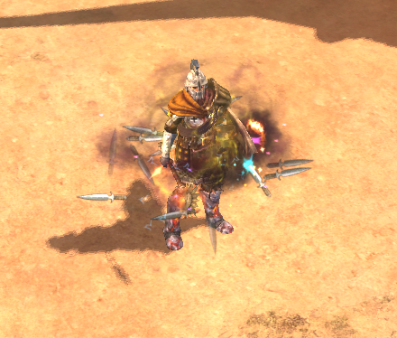
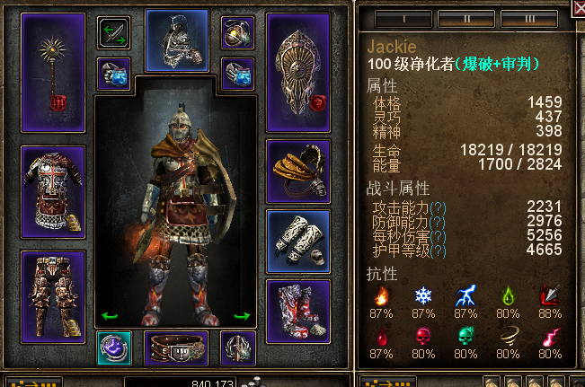
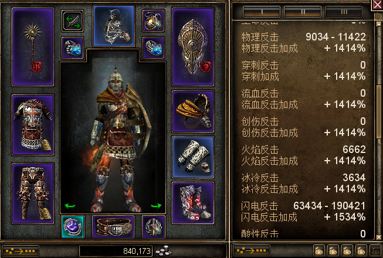
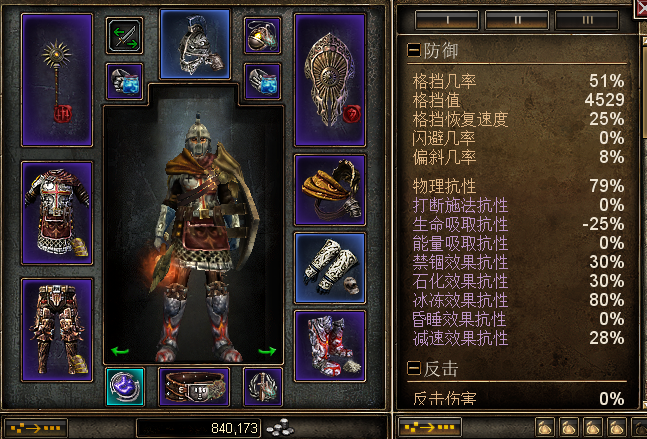

# 老实巴交的站撸净化

全紫净化，站撸碎境 80，上限未知  

思路  
净化想要站撸，无非就是提升抗性，提升物抗，吸血，加回血，加减伤。  
这里利用的，是反击类装备带来的抗性提升（主要是物抗）。破晓套和两件黎明守卫套在最后能带来 19w 的闪电反击，2w 的其他反击，受攻击后，反击能进一步提升 2w 左右。  
破晓套能带来 16% 物抗  
黎明守卫头部有 5% 物抗  
手有 5% 物抗  
力量之印 4% 物抗  
衣服 6% 物抗，衣服状态 5% 物抗  
裤子 5% 物抗  
鞋子 5% 物抗  
信念光环 15% 物抗  
这里 66% 物抗

其中一个星座方案加点 13% 物抗，一共 79% 物抗，接近溢出。打 75 - 76，到 boss 层基本吃血就能回过来，不用走位。就是打得比较慢，会超时，这是点了方尖碑的缘故，攻击力拉低了。  
这个加点方案的模拟器：https://www.grimtools.com/calc/eVL6L15N  
抗性溢出毒溢出接近 40%，其他溢出包括晕眩 50% 以上。  
至于攻击。。。开满状态之后就一招，勋章的附魔。。。其他都是反击攻击，所以打得慢。角色就只有负责扔秘印、扔黑水鸡尾酒、扔闪光弹、扔铝热地雷的份，并且这 4 个脸滚键盘还真能大幅提升攻击效率。

贴几张图  
  
  
  

可以看到，OA 其实并不高，但是闪电反击最低伤害和最高伤害差别十分大，自带暴击效果，恰好对应了这个 bd 没有力气去堆暴击的现状。da 受到攻击时 3.1k，护甲在受到攻击时可以去到 5.3k。

很多人不理解为什么复仇光环加到满。复仇光环加到满是为了 cd，现在的 cd 1.4 秒时间，攻击力不高，但是奥祖因的愤怒（扩展技能）单附反就 8k - 1.8w，同时攻击 7 个人。这也不重要，重要的是 15% 的攻击伤害转化为生命。相当于 75 - 76 被群的情况下，1.4 秒秒回，回满。

至于腰带和徽章，双嘲讽，拉 boss 用的。腰带的护甲加成很给力，有空锤一个属性比较好的出来。  
目前还有疑问就是两个戒指怎么选，毕竟目标是全紫。  
这个净化的缺陷是地板受不了，回血跟不上，需要走动一两下，我稍后会另外搓一个回血净化，那个净化降低了物抗，记忆中点不出方尖碑，会大大强化攻击、吸血和回血，就只换了星座加点，算是比较难搓出来，看运气。

看一下装备搭配：  
头 神话的黎明守卫头盔 镶嵌：巨人铠甲片 附魔：莫格卓根的触摸（恶魔十字）  
项链 神话的破晓者的信标 镶嵌：污染之心 附魔：蛇人毒液（恶魔十字）  
戒子 神话的复仇之拳 神话的仁慈之手 镶嵌：复仇之魂 附魔：蛇人毒液（恶魔十字）  
盾 神话的破晓者的使命 镶嵌：力量之印 附魔：马尔茅斯的意志  
肩 神话的破晓者的护肩 镶嵌：神圣铠甲片 附魔：拜斯迈的帷幕之触  
手 神话的黎明守卫手甲 镶嵌：躁动遗骸 附魔：莫格卓根的触摸（恶魔十字）  
鞋子 神话的巨像降生护胫 镶嵌：魔法大地 附魔：拜斯迈的帷幕之触  
徽章 马尔科夫的谋略 镶嵌：污染之心 附魔：德里格之疤符文  
腰带 神话的落锤腰带 镶嵌：巫登沼泽皮革 附魔：人族的监视  
圣物 复仇者  
裤子 神话的荆棘兽皮裹腿 镶嵌：远古盔甲片 附魔：拜斯迈的帷幕之触  
衣服 神铁锁子甲 镶嵌：远古盔甲片 附魔：拜斯迈的帷幕之触  
武器 神话的破晓者的巨锤 镶嵌：刀刃之印 附魔：放逐者的堡垒